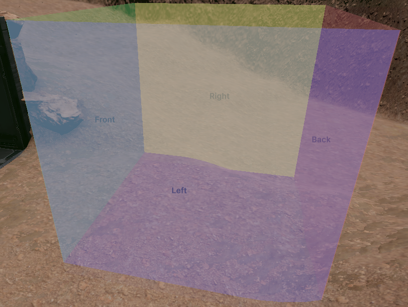

Use this script to create a trigger box collision which is able to determine which direction the object/player entered or exited from.
I typically have need for a trigger box that can detect a "direction" from which a character is interacting with the trigger box.  This allows me to use the trigger box to do things such as opening & closing doors easily.  For example, if the character enters the trigger box from the left or from the right, open the door.  If the player exits the trigger box from the right or left, close the door.  There are many actions you can define based on trigger box "side" and direction.

