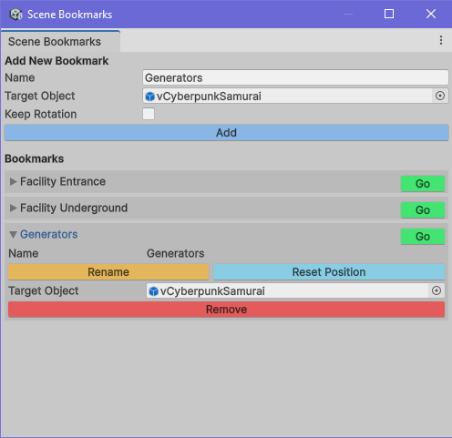

Ever need to save many positions in your large scene so you can jump around easily?  
Well there are many tools for that.  There is TaskAtlas, CameraBookmarks by borgsystem and plenty of others. But the problem is they just manipulate the scene camera which isn't very helpful when you need to move your character to those positions.  Task Atlas has some advanced features but it is not compatible with Unity 6 and it can't do that one simple thing.  Which for me was a HUGE problem. So here is a script I wrote (with the help of ChatGPT) that will allow you to save positions based on your current scene view *BUT* you have can have an optional Target Object, for me a character, placed at that position.  So when you "Go" to that position, not only does your Scene View camera jump there, your Target Object is moved there also.

* When you **Add** a new Bookmark you define a Label and Target Object if you want.
* In the dropdown your can **Rename**, **Remove** and **Reset Position**

Sometimes that character or scene view isn't exactly where you might want it. So simply move the Target Object (in my case the character) and select **Reset Position**. Now that bookmark will be placed right where the Target Object is.

There is no need to put this in an _Editor_ directory and all Bookmarks are saved in a ScriptableObject in the same directory as this script so your Scene is never polluted.
  
You will find it under Tools -> Nasty Diaper -> Scene Bookmark Manager 

