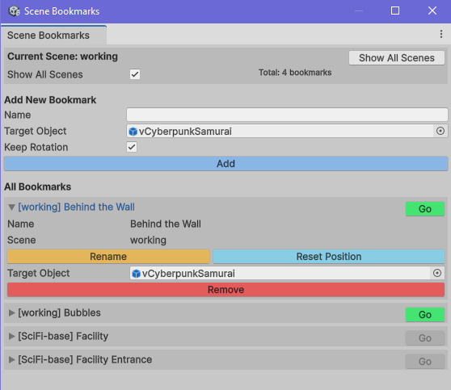

Ever need to save many positions in your large scene so you can jump around easily?  
Well there are many tools for that.  There is TaskAtlas, CameraBookmarks and plenty of others. They definitely have their place as projects like Task Atlas provide so much functionality but the problem is they just manipulate the scene camera which isn't very helpful when you need to move your character to those positions.
Task Atlas has some advanced features but it is not compatible with Unity 6 and it can't do that one simple thing.  Which for me was a HUGE problem. 

This tool allows you to place bookmarks around your scene, just as any other bookmark tool, *BUT* it will also move whatever Target Object you have assigned to that bookmark as well.  Which in my case was my TPS player.  So now when you "Go" to that position, not only does your Scene View camera jump there, your Target Object is moved there also.

This tool also contains multi-scene support. Now you can jump between scenes or have multiple scenes open and the **SceneBookmarkManager** can handle that for you.

The scripts will be placed in _Assets/NastyDiaper/SceneBookmarks/Editor_
   * SceneBookmark.cs
   * SceneBookmarkDatabase.cs
   * SceneBookmarkManager.cs
   * SceneBookmarkDatabase - Is an automatically generated database to maintain all references. Your scenes will not be polluted with extra gameobjects or scripts

_Name_  - This will be the name of your Bookmark

_Target Object_  - This is the Object you want moved. If you only want the scene view camera moved this should be empty

_Keep Rotation_  - When you **Add** a bookmark, the rotation of the scene view camera is saved. This rotation will be applied to the Target Object as well which could result in odd rotations. If this is checked, the current Target Objects' rotation will be used.

* **Add**
   - This will add a new bookmark with the given name at the current scene view. If a Target Object is defined, that object will be move there as well.
* **Go**
   - This will mode you to the defined bookmark
* **Rename**
   - This allows you to rename your bookmark
* **Reset Position**
   - Sometimes your camera or Target Object won't be positioned quite as you like it. Often the Target Object may be off the floor. If this is the case, move Target Object where you need it to be an hit **Reset Position**
* **Remove**
   - This is exactly what you think, just removes the bookmark

You will find it under   **Tools** &#8594; **Nasty Diaper** &#8594; **Scene Bookmark Manager**

